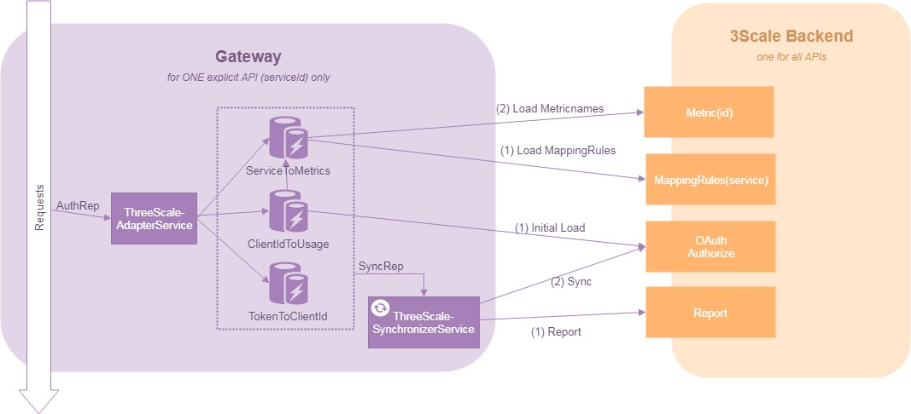

# APIM Adapter
[](https://ci.sbb.ch/job/KD_APIM/job/apim-adapter/job/develop/)

A low latency API Management Adapter for Java Applications.

# How it works

## Big Picture


## See also ...
- [APIM - Homepage](https://issues.sbb.ch/issues/?filter=84802&jql=project%20%3D%20AITG%20AND%20component%20in%20(APIM%2C%20APIM-Betrieb)%20ORDER%20BY%20status%20ASC%2C%20Rank%20ASC)
- [APIM - Adapter vs. Gateway](https://confluence.sbb.ch/pages/viewpage.action?pageId=1157204897)

# Issues
- [APIM - Issues](https://issues.sbb.ch/issues/?filter=84802&jql=project%20%3D%20AITG%20AND%20component%20in%20(APIM%2C%20APIM-Betrieb)%20ORDER%20BY%20status%20ASC%2C%20Rank%20ASC)


# Features
- AuthRep for all requests (except first request for each client after restart) is done asynchronously: means, the calculations are based on the state of the cache.
- Average latency for AuthRep: 0.3ms
- Synchronization with 3scale backend is done periodically, single-threaded and in a configurable interval >= 1s
- Average latency for Sync with 3scale Backend: 0.2ms
- Synchronization with 3scale backend includes the following: report hit-count per metric if it is greater than 0 (and reset local counter back to 0), load consistent usages and use them as the new base values for counting. Reporting is only done when there are Hits to pe reported. Synchronization of the Usages are done every time.
- Given a persisted cache location (like a PV) is provided, the adapter caches configuration read from remote 3scale backend. When adapter starts back up and is unable to read configuration remotely, it is able to fall back using latest cache states.

## Performance Reports
coming soon

# Integration
There are 3 ways how this adapter can be introduced into you system.
- **APIM-Gateway:** Use it as a lightweight standalone application. Further Information: [APIM - Gateway](https://code.sbb.ch/projects/KD_APIM/repos/apim-adapter/browse/apim-gateway/README.md)
- **Spring:** You can use the dependency ```apim-adapter-springboot``` or ```apim-adapter-springboot2``` and use the adapter within a spring context. In this case the ```ApimAdapterFilter``` and ```ApimAdapterService``` are automatically added to you spring application. Example project: [tbd](todo) 

- **Custom:** You can use the dependency ```apim-adapter-core``` and ensure that http-requests are handled by the ```apimAdapterService```. 

# LogLevel
- To set the log level set the environment variable **APIM_GATEWAY_LOG_LEVEL** to one of the following values:
    - DEBUG
    - INFO
    - WARN (default if the variable is not set)
    - ERROR
- **APIM_GATEWAY_REQUEST_LOG_LEVEL**  is a specific loglevel for the logging of every Request. It can be set to the following values    
    - DEBUG 
        - equal to INFO
    - INFO  (DEFAULT)
        - Every request will produce one line of LOG 
        - example: ``` APIM-4001: Req/Res message=Connection to backend completed returnedStatusCode=200 TotalDuration=1 ms ApimDuration=0 ms ProxyDuration=1 ms proxyRequestStatus=COMPLETED clientId=watchdog-dev-aws clientAllowed=true method=GET status=/api/watchdog path= queryString='{}'```
    - WARN
        - Only Request with a Statuscode not between 200 - 499 will be logged (e.g. 503)
        - example: ``` APIM-5007: Req/Res message=Connection to backend failed returnedStatusCode=503 TotalDuration=6007 ms ApimDuration=0 ms ProxyDuration=3006 ms proxyRequestStatus=FAILED clientId=watchdog-dev-aws clientAllowed=true method=GET status=/api/watchdog path= queryString='{}'```
    - ERROR 
        - Nothing will be logged about the Request    
# Health & Readiness
The service provides both health and readiness checks
## Health
During health check we verify that all runtime requirements are fulfilled.
These are the following:
- Check if a proxy is loaded (either from api-management-backend or emergency mode configuration)
- Check if the Sync thread is not looked for more than 5 * the sync period
## Readiness
Here we check all startup dependencies, which includes all health checks

**Keep in mind, the readiness check is only relevant at startup, so the adapter will work without any problems if it fails afterwards**
So if you implement readiness checks, only check readiness on startup and keep it up afterwards. The adapter recovers itself.

Have a look at the implementation of the readiness checks in the gateway:
[code.sbb.ch](https://code.sbb.ch/projects/KD_APIM/repos/apim-adapter/browse/apim-gateway/src/main/java/com/networknt/apim/handler/ReadinessHandler.java)

These are the following:
- all health checks
- connection to RHSSO
- connection to 3scale admin
- connection to 3scale backend

# Roadmap
## Next Steps
- Preload initial configs from 3scale already at startup to reduce latency of first request
- Merge MappingRules for the plan of a client at sync
- Introduce circuit breaker for all dependencies
## Further Improvements
- Automatic Testing
- Introduce a shared memory cache to be more consistent

# Develop
## Run locally
* maven clean install exec:exec
* with the following environment variables
    * APIM_ADMIN_HOST
        - 3scale-admin.dev.app.ose.sbb-aws.net
    * APIM_BACKEND_HOST
        - backend-3scale.dev.app.ose.sbb-aws.net
    * APIM_BACKEND_TOKEN
        - **replace**
    * APIM_ADAPTER_PRODUCTION_MODE
        - false
    * APIM_TOKENISSUER_1_URL_PATTERN
        - https://sso-dev.sbb.ch/auth/realms/(SBB_Public)
    * APIM_ADAPTER_SERVICE_ID
        - **replace**
    * APIM_ADMIN_TOKEN
        - **replace**
    * APIM_MONITORING_PUSH_HOST
        - http://pushgateway-monitoring.dev.app.ose.sbb-aws.net
    * APIM_MONITORING_NAMESPACE
        - local-project
    * APIM_MONITORING_ID
        - pod-name
    * APIM_MONITORING_LEVEL
        - ALL
    * APIM_CACHE_LOCATION
        - target/apim_cache
        

`APIM_CACHE_LOCATION` can also be omitted, then it falls back to default value `DISABLED` which deactivates offline configuration caching.

# Error Codes
 - APIM-1000				INFO
 - APIM-2000				WARN
 - APIM-3000 				ERROR
 - APIM-4000				INFO-GATEWAY
 - APIM-5000				WARN-GATEWAY
 - APIM-6000				ERROR-GATEWAY
